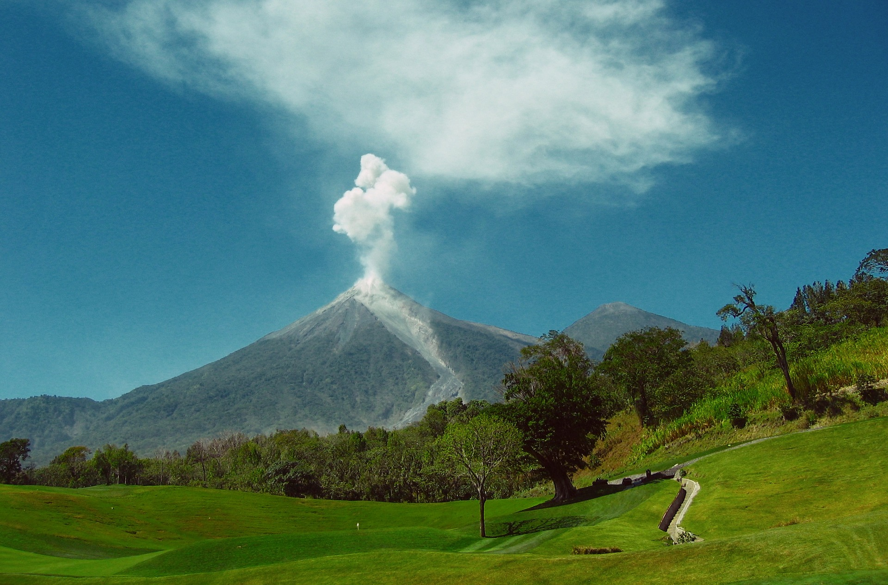

```{r setup, include=FALSE}
knitr::opts_chunk$set(echo = TRUE)
```
# Descripció

Aquest dataset conté informació d'avisos de cendra volcànica (*Volcanic Ash Advisories* - VAA) generats pel VAAC ("*Volcanic Ash Advisory Centre*") de Washington, que corresponen als casos que hi ha hagut observació mesurada dins del periode des d'Octubre del 2017 fins Març del 2018. 



**Context**

Els centres VAAC han sigut creats per l'Organització d'Aviació Civil per monitoritzar l'activitat volcànica i així alertar a les organitzacions pertinents si és necessari. D'aquesta manera aquestes poden posar en marxa plans de contingència per evitar els efectes catastròfics que un núvol de cendres pot produir, principalment en el tràfic aeri, evidentment.

El canal establert per aquestes alertes és la publicació d'informes per part de cada VAAC sobre l'activitat observada en la seva zona assignada. En el cas del VAAC de Washington, la regió que cobreix inclou Estats Units, Centre Amèrica, l'oest de l'oceà Atlàntic i gran part de l'oceà Pacífic (http://www.ssd.noaa.gov/VAAC/washington.html). Normalment, aquesta publicació es realitza en la pàgina web corresponent una vegada que s'ha reunit la informació sobre l'activitat observada.

Aquests informes són els anomenats avisos de cendra volcànica (VAA). A grans trets, inclouen dades que caracteritzen el núvol observat, el volcà que l'originat, i prediccions del possible núvol que pot haver hores després. 

# Contingut

El dataset que aquí es publica conté registres que proporcionen característiques de les activitats observades des del VAAC de Washington en el periode contingut entre Octubre de 2017 i Març de 2018. Aquestes mostres són resultat d'haver filtrat els avisos publicats en aquest periode de manera que només tenim els casos en que s'havia produït una observació mesurada. És freqüent que es publiquin alertes perque ha arribat la informació de l'existència d'activitat però no s'arriba a identificar el núvol via satèl·lit. En aquest cas, es considera que es tracta d'activitat sense impacte i de poc valor d'anàlisi.

En els VAA originals també es publica informació adicional sobre l'activitat, però ens centrarem en la referent al núvol observat i les prediccions realitzades.

Les mostres d'aquest dataset contenen els següents camps:

**VA_DATE**: data del VAA en el format YYYYMMDDHHMM.

**VOLCANO_NAME**: nom del volcà al que fa referència el VAA.

**VOLCANO_ID**: número identificador del volcà.

**OBS_DATE**: data en la que s'ha produit l'observació de l'activitat volcànica, en el format YYYYMMDDHHMM.

**OBS_LOWALT**: altitud més baixa on es localitza el núvol observat. Normalment expressat en FLs donant les unitats de 100 peus (per exemple, FL100 equival a 10000 peus), també pot valer SFC o UNKN, que voldria dir que és a nivell del mar.

**OBS_HIGHALT**: altitud más alta del núvol observat, en FLs.

**OBS_CONTOUR**: descriu el contorn del núvol observat, un polígon definit per un conjunt de punts. Aquest camp és la seqüència de coordenades latitud/longitud decimals dels punts. Per exemple, la seqüència:

"N1429W09052N1411W09115N1420W09119N1429W09052"

ens està donant un polígon de quatre punts:

[14.29º Nord,90.52º Oest],[14.11º Nord, 91.15º Oest],[14.20º Nord, 91.19º Oest] i [14.29º Nord, 90.52º Oest].

**FCST+6_DATE**: data per la predicció a 6 hores vista, en el format YYYYMMDDHHMM.

**FCST+6_LOWALT**: altitud més baixa que es dòna al núvol predit per sis hores després. Com el cas d'observació, normalment expressat en FLs, però també pot ser SFC o UNKN, ambdós pel cas de nivell de mar.

**FCST+6_HIGHALT**: altitud més alta pel núvol de la predicció a 6 hores. Expressat en FL.

**FCST+6_CONTOUR**: seqüència de punts definint el polígon que descriu el contorn del núvol predit per després de sis hores. En el cas de no esperar que hi hagi cap núvol, rep el valor "NO ASH".

**FCST+12_DATE**: data per la predicció a 12 hores vista, en el format YYYYMMDDHHMM.

**FCST+12_LOWALT**: altitud més baixa que es dòna al núvol predit per dotze hores després. Com el cas d'observació, normalment expressat en FLs, però també pot ser SFC o UNKN, ambdós pel cas de nivell de mar.

**FCST+12_HIGHALT**: altitud més alta pel núvol de la predicció a 12 hores. Expressat en FL.

**FCST+12_CONTOUR**: seqüència de punts definint el polígon que descriu el contorn del núvol predit per després de dotze hores. En el cas de no esperar que hi hagi cap núvol, rep el valor "NO ASH".

**FCST+18_DATE**: data per la predicció a 18 hores vista, en el format YYYYMMDDHHMM.

**FCST+18_LOWALT**: altitud més baixa que es dòna al núvol predit per divuit hores després. Com el cas d'observació, normalment expressat en FLs, però també pot ser SFC o UNKN, ambdós pel cas de nivell de mar.

**FCST+18_HIGHALT**: altitud més alta pel núvol de la predicció a 18 hores. Expressat en FL.

**FCST+18_CONTOUR**: seqüència de punts definint el polígon que descriu el contorn del núvol predit per després de divuit hores. En el cas de no esperar que hi hagi cap núvol, rep el valor "NO ASH".

Qualsevol dels camps pot contenir el valor 'NA' si no s'ha trobat el paràmetre corresponent en el format esperat en el VAA. En canvi, pels relacionats amb les prediccions es considera que si no es troben es perque en el VAA no hi ha predicció, i per tant rep el valor 'None'.

Com ja s'ha mencionat, aquestes dades són resultat d'un processament dels VAA publicats en el VAAC de Washington. Concretament, els VAA s'han recollit directament de la seva pàgina web oficial que es troba en el lloc web de *NOAA Satellite and Information Service*, organització de la que forma part, mitjançant tècniques de *Web Scraping* implementades en llenguatge Python. La solució escollida ha sigut fer servir el mòdul de *Beautiful Soup*, per la seva bona usabilitat en el cas que ens ocupa, que no requerim d'un alt rendiment.

# Agraïments

Aquestes dades s'han recopilat a partir dels VAA del VAAC de Washington, publicats per *NOAA Satellite and Information Service* (http://www.ssd.noaa.gov).

Tanmateix, la comprensió dels informes VAA ha sigut gràcies a la descripció aportada en la publicació del blog *The volcanism blog*: "How to read a Volcanic Ash Advisory" (https://volcanism.wordpress.com/2009/12/04/how-to-read-a-volcanic-ash-advisory/)

Finalment el scraping que s'ha dut a terme està basat en metodologies proporcionades en:

Richard Lawson. *Web Scraping with Python*. Packt Publishing Ltd, October 2015

i fent servir el mòdul de Beautiful Soup de Python:
https://www.crummy.com/software/BeautifulSoup/bs4/doc/

# Motivació

És evident que la informació que es proporciona en els *Volcanic Ash Advisories* és de vital importància. Avui dia, són les dades oficials a partir de les quals les companyies aèries prenen decisions sobre quins vols cancel·lar o no quan els volcans produeixen núvols de cendra, cosa que ocurreix constantment. Estem parlant de decisions amb gran impacte. 

Com ja s'ha comentat, aquests informes VAA proveeixen de observacions mesurades i també de prediccions. Aquestes prediccions tenen una certa qualitat i en principi són estimades amb cautela. Una aplicació directa dels VAA és monitoritzar la seva publicació per poder realitzar estimacions amb les que obtenir una predicció acurada i poder prendre llavors les decisions pertinents amb millor informació. Partir d'un dataset d'aquest tipus com a suport en les tasques de desenvolupament dels predictors pot resultar molt convenient.

Tanmateix, un altra enfocament que es pot donar a la predicció és dins de l'àmbit de mineria de dades. Per exemple, extreient coneixement comparant les prediccions dels VAA amb les observacions en els VAA posteriors (notar que el procediment habitual és publicar VAA amb noves observacions en les dates de les prediccions donades). En aquest cas, aquest dataset també pot ser de gran utilitat.
 
# Llicència

Aquest dataset és publicat sota la llicència CC BY 4.0, per les següents raons:

* S'exigeix que es reconegui l'autoria del dataset original; per tant, es donarà visibilitat a la feina específica feta aqui.

* Es permet l'ús comercial, necessari per a que aquesta obra tingui impacte a causa del context en que estem parlant com és l'aviació civil. És d'esperar que els principals interessats siguin companyies aèries o empreses que vulguin desenvolupar software d'aplicacions predictives orientat a aquestes companyies. Per a aquesta mateixa raó, no es demana que cap obra derivada sigui distribuïda sota la mateixa llicència, per a que aquesta sigui reutilitzada el màxim possible.

# Codi font generador

El codi font es pot trobar en https://github.com/NataliaGutierrez/WebScraping/tree/master/src

# Dataset

El dataset creat està contingut en el següent fitxer en format csv: https://github.com/NataliaGutierrez/WebScraping/tree/master/doc/dataset.csv


